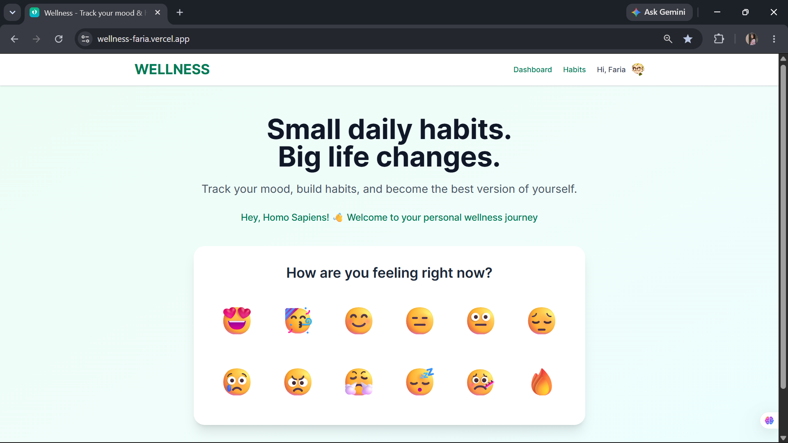

# WELLNESS

Full-stack mood and wellness tracking app built as a personal learning project in 2026.

Track moods, build healthy routines, review trends, and export your history from one calm dashboard.

## Preview



This is a preview of the WELLNESS homepage.

## Tech Stack

<p>
  
  
  
  
  
  
  
  
  
</p>

<details>
  <summary><strong>Version slide note</strong></summary>

| Tool | Version / Usage |
| --- | --- |
| Next.js | `16.1.6`, App Router |
| React | `19.2.3` |
| TypeScript | `^5` |
| Tailwind CSS | `^4` |
| Clerk | `@clerk/nextjs ^6.39.0` |
| Prisma | `5.18.0` |
| Supabase | PostgreSQL database hosting |
| Recharts | `^3.8.1` |
| Vercel | Deployment platform |

</details>

## Project Status

WELLNESS is a working full-stack app with authentication, protected pages, mood logging, habit tracking, statistics, CSV export, and settings.

## Highlights

- Secure sign-up, sign-in, session management, and protected routes with Clerk
- Personal mood logging with optional notes and user-scoped history
- Dashboard with pagination, edit actions, and delete actions
- Habit tracker with daily check-ins, optimistic updates, completion history, and mood insights
- Statistics page with weekly and monthly trends, averages, distribution, and best-day insight
- CSV export for mood history
- Settings page with local dark mode, profile updates, and profile picture upload
- API routes for moods, habits, statistics, and export
- Cloud PostgreSQL database powered by Supabase and Prisma

## Core Features

### Mood Tracking

- Quick mood picker from the public landing page
- Protected `/dashboard` route for personal mood logs
- Optional mood notes with a character limit
- Mood history pagination
- Edit and delete actions for previous mood logs

### Habit Tracking

- Add, edit, and delete routines from a protected habit page
- Emoji presets and free-form emoji input
- Eight color themes for visual organization
- Daily check-off and undo actions
- Daily progress summary and completion meter
- Monthly completion rate on each habit card
- Seven-day completion history strip
- Mood insight cards comparing completed vs missed days
- Confirmation dialog before deleting a habit and its completion history

### Insights And Export

- Average mood score overall and for the current month
- Most common mood and full mood distribution
- Weekly and monthly trend charts
- Best day this week insight
- CSV mood-history export from the statistics page

### Settings

- Local dark mode toggle persisted in local storage
- Profile name update through Clerk
- Profile picture upload through Clerk

### AI Mood Insights

- AI-generated insights on mood patterns and habit correlations
- Powered by Hugging Face's Open-Orca 120B model
- Custom prompt engineering for personalized feedback

## API Endpoints

| Method | Endpoint | Purpose |
| --- | --- | --- |
| `POST` | `/api/log-mood` | Create a mood log |
| `GET` | `/api/log-mood?page=1&limit=5` | Paginate mood history |
| `PATCH` | `/api/log-mood` | Update a mood note |
| `DELETE` | `/api/log-mood` | Delete a mood log |
| `GET` | `/api/habits?date=YYYY-MM-DD` | Load habits, completion state, and insights |
| `POST` | `/api/habits` | Create a habit |
| `PATCH` | `/api/habits` | Update a habit |
| `DELETE` | `/api/habits` | Delete a habit and completion history |
| `POST` | `/api/habit-completion` | Toggle a habit for a specific day |
| `GET` | `/api/mood-stats` | Load aggregated mood stats and trends |
| `GET` | `/api/export-moods` | Download mood history as CSV |

## Data Model

| Model | Fields |
| --- | --- |
| `Mood` | `id`, `userId`, `mood`, `note`, `createdAt` |
| `Habit` | `id`, `userId`, `name`, `emoji`, `frequency`, `color`, `createdAt`, `updatedAt` |
| `HabitCompletion` | `id`, `habitId`, `userId`, `date`, `completedAt` |

## Roadmap

- Calendar view
- Extra UI polish


## Run Locally

Clone the project and install dependencies:

```bash
git clone https://github.com/faria-A7/wellness.git
cd wellness
npm install
```

Create a `.env` file:

```env
NEXT_PUBLIC_CLERK_PUBLISHABLE_KEY=...
CLERK_SECRET_KEY=...
DATABASE_URL=...
DIRECT_URL=...
HF_TOKEN=...
# The API also accepts HF_API_KEY for local compatibility.
# Optional:
HF_MODEL=openai/gpt-oss-120b:groq
```

Start the development server:

```bash
npm run dev
```

## AUTHOR

Built by [faria-A7](https://github.com/faria-A7).
